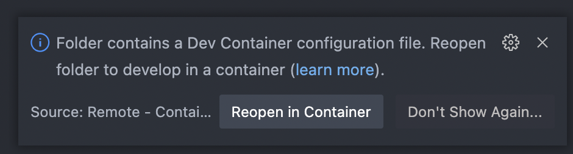

# Idris 2 Docker

Multi-arch, multi-distro Docker images for Idris 2, primarily aimed for devcontainers.

Architectures: `amd64`, `arm64`

Idris2-lsp `latest` (Up to date with [idris2-lsp/main](https://github.com/idris-community/idris2-lsp/tree/main) - recompiled daily). And Idris2 version tested as submodule inside idris2-lsp.

## Table of Contents

* [Motivation](#motivation)
* [Images](#images)
* [Devcontainer Demo: Wordle in Idris](#devcontainer-demo-wordle-in-idris)
  * [Prerequisites](#prerequisites)
  * [Opening in a Devcontainer](#opening-in-a-devcontainer)
* [Usage](#usage)
  * [Devcontainer](#devcontainer)
  * [Command Line](#command-line)
  * [Base Image](#base-image)
* [Credit](#credit)

## Motivation

Installing Idris2 is [quite time consuming](https://idris2.readthedocs.io/en/latest/tutorial/starting.html) and [not very intuitive](https://github.com/idris-lang/Idris2/issues/2404), [especially for Apple Silicon](https://www.reddit.com/r/Idris/comments/wyox7i/building_idris2_for_apple_silicon_as_of_august/). That presents quite a bottleneck for new users. This project aims to provide a quick and easy way to get started with Idris2 and idris2-lsp without having to go through the entire process on your own machine.

## Images

* [idris-2-docker/devcontainer](https://github.com/joshuanianji/idris-2-docker/pkgs/container/idris-2-docker%2Fdevcontainer) - Debian bullseye built off of [Microsoft's Devcontainer Base image](https://github.com/microsoft/vscode-dev-containers/tree/main/containers/debian)
* [idris-2-docker/ubuntu](https://github.com/joshuanianji/idris-2-docker/pkgs/container/idris-2-docker%2Fubuntu) - Ubuntu 20.04
* [idris-2-docker/debian](https://github.com/joshuanianji/idris-2-docker/pkgs/container/idris-2-docker%2Fdebian) - Debian bullseye

## Devcontainer Demo: Wordle in Idris

Devcontainers use a Docker container as a full-featured development environment, making it super simple to get started with Idris2. For more information, check out [Microsoft's documentation](https://code.visualstudio.com/docs/remote/containers).

If you want to try out a quick ready-to-use project, take a look at [calebji123/WordleInIdris](https://github.com/calebji123/WordleInIdris). The devcontainer files there are set up and it's super fun to play around with!

### Prerequisites

* A working instance of [Docker](https://docs.docker.com/get-docker/)
* [VSCode](https://code.visualstudio.com/download)
* [Remote Development Extension Pack](https://marketplace.visualstudio.com/items?itemName=ms-vscode-remote.vscode-remote-extensionpack) for VSCode

### Opening in a Devcontainer

```bash
git clone https://github.com/calebji123/WordleInIdris.git
```

Once you clone the repo, open the folder in VSCode. There will be a prompt on the bottom right.



Click "Reopen in Container" and it will download the image and open the project in a devcontainer. You'll be able to [run the project right away](https://github.com/calebji123/WordleInIdris#how-to-run-it)!

## Usage

### Devcontainer

Add devcontainers to your own project by copying the following contents to `Dockerfile` in the root of your project:

```dockerfile
FROM ghcr.io/joshuanianji/idris-2-docker/devcontainer:latest
```

Then, using Microsoft's Remote SSH tools, click "Reopen in container" and choose that Dockerfile.

### Command Line

You can also run the image directly from the command line.

```bash
docker run -it --rm ghcr.io/joshuanianji/idris-2-docker/ubuntu:latest
$ idris2 --version

docker run -it --rm --entrypoint /bin/bash ghcr.io/joshuanianji/idris-2-docker/debian:latest
$ idris2 --version
```

### Base Image

You can also use one of the images as a base image for your own Dockerfile.

```dockerfile
FROM ghcr.io/joshuanianji/idris-2-docker/debian:latest

# ...
```

## Credit

* [dgellow/idris-docker-image](https://github.com/dgellow/idris-docker-image) for giving me a starting point
* [YBogomolov's Gist](https://gist.github.com/YBogomolov/dc49c610cf7d92c60fb4678bae3ab753) for Devcontainer pointers
